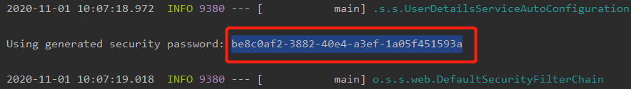
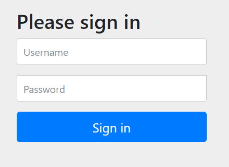
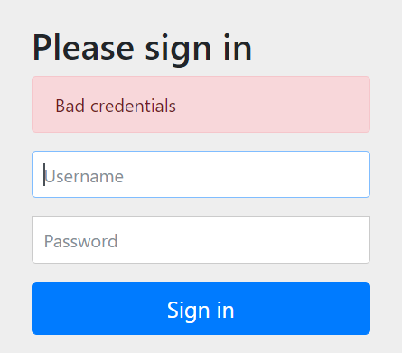
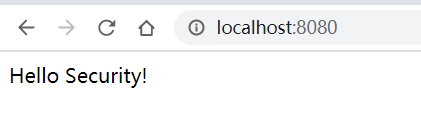

## Spring Security01：Hello Security入门

## 一、创建一个SpringBoot项目

略

## 二、pom.xml导入Maven依赖

```xml
<dependencies>
<dependency>
	<groupId>org.springframework.boot</groupId>
	<artifactId>spring-boot-starter-security</artifactId>
</dependency>
<dependency>
	<groupId>org.springframework.boot</groupId>
	<artifactId>spring-boot-starter-web</artifactId>
</dependency>

<dependency>
	<groupId>org.springframework.boot</groupId>
	<artifactId>spring-boot-starter-test</artifactId>
	<scope>test</scope>
	<exclusions>
		<exclusion>
			<groupId>org.junit.vintage</groupId>
			<artifactId>junit-vintage-engine</artifactId>
		</exclusion>
	</exclusions>
</dependency>
<dependency>
	<groupId>org.springframework.security</groupId>
	<artifactId>spring-security-test</artifactId>
	<scope>test</scope>
</dependency>
</dependencies>
```

## 三、Cotroller类

- 创建web包并在其下面创建一个HelloController类

```java
@RestController
public class HelloController {
    @RequestMapping("/")
    public String hello(){
        return "Hello Security!";
    }
}
```

## 四、运行项目

1.可以看到下图生成的密码，账号默认是user



2.打开浏览器，在地址栏输入http://localhost:8080，它会重定向到http://localhost:8080/login，要求输入用户名密码并登录，如下图



3.输入的用户名或密码错误会跳到http://localhost:8080/login?error



4.输入的用户名或密码正确后会跳回http://localhost:8080



大功告成！！！